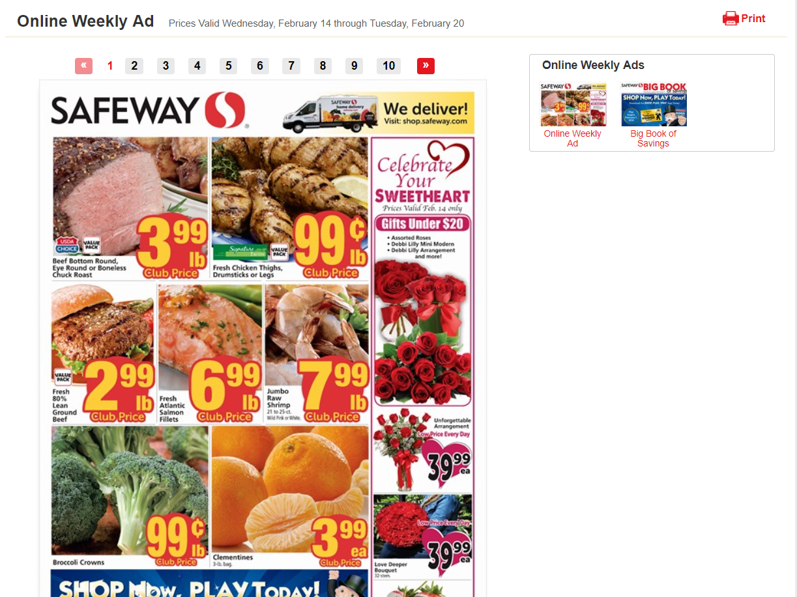

# Grocery Sales App

In an effort to save time and money, my girlfriend and I developed a Python application to track prices across multiple grocery stores.

Most if not all grocery stores have a web version of their local ads. The core challenge is to parse out grocery items and relevant metadata from local ads that are presented and structured on web pages in a variety of ways.

Here is an example of an ad from Safeway:

The data is then stored in a MySQL database with essential fields
* Item's specific title
* Item, broad category
* Item quantity
* Item size
* Item price
* Item brand name
* Deal expiration date
* Must be member? flag
* Coupon needed? flag
* Grocery store name
* Store branch
* Location address
* Online only, in store only, or both

Major TODOS:
* Amass enough data to analyze historical trends and/or predict future grocery sales
* Determine sales trends for season, location, store, item, etc.
* Determine whether to turn app into a web application and build out a front-end
